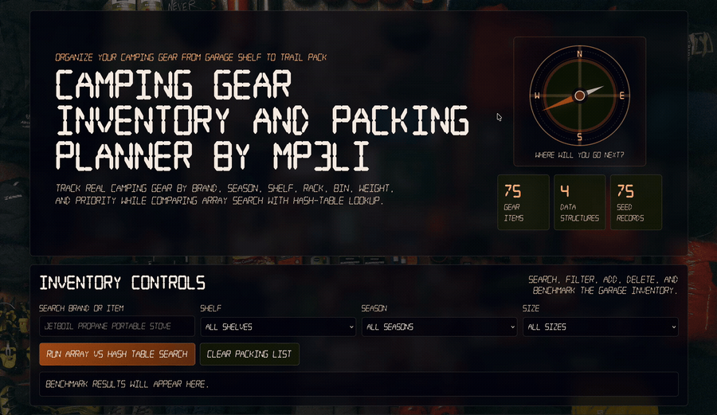
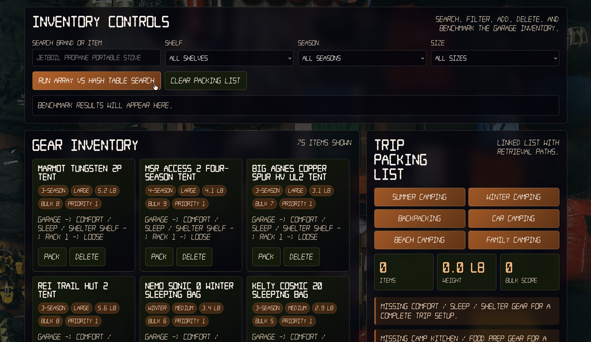
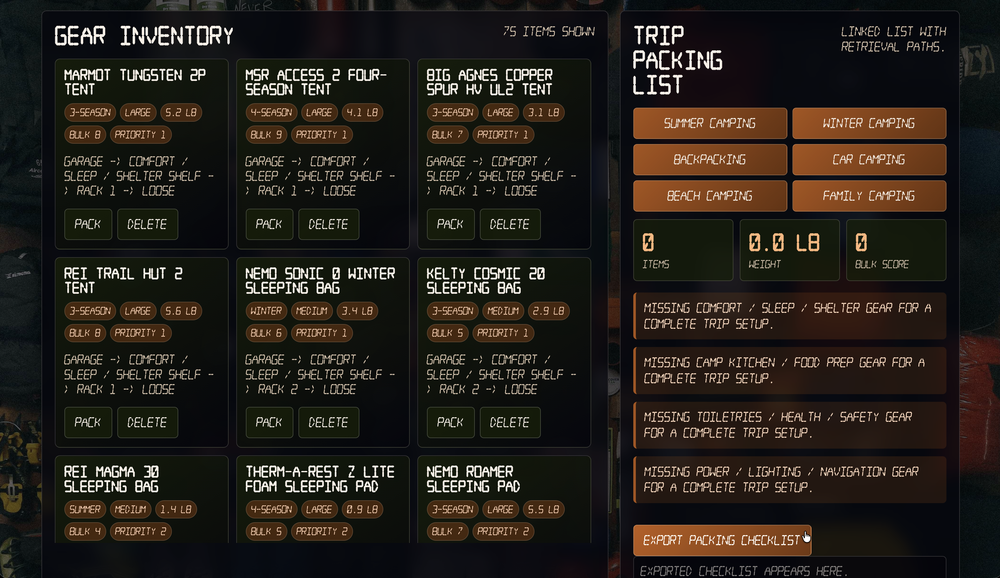
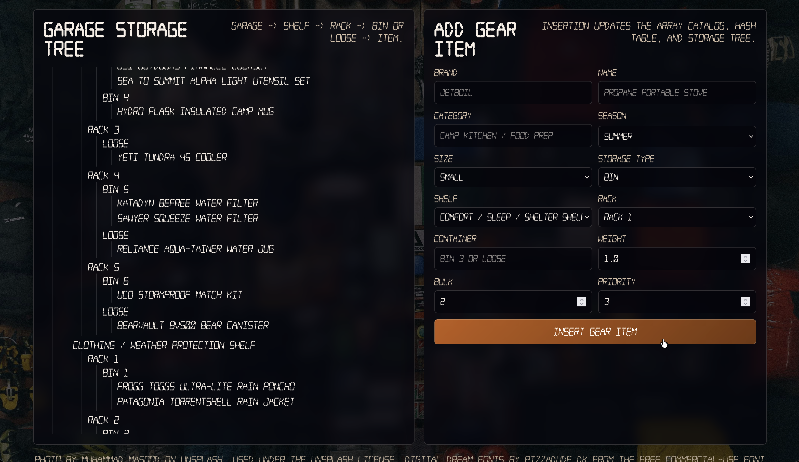
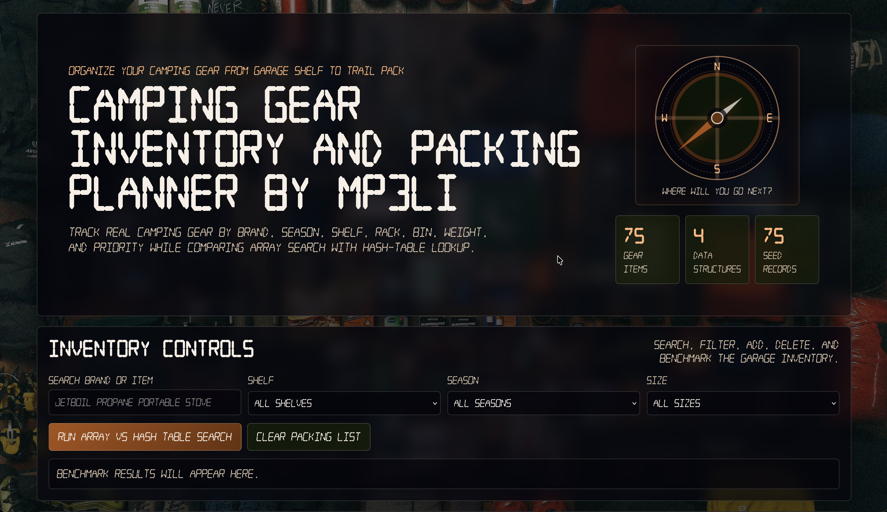

<p align="center">
  
</p>

<p align="center">
  
</p>

<p align="center">
  A standalone browser app for turning scattered camping gear into a searchable storage map, trip-ready packing list, and data-structures demo with real lookup, traversal, benchmark, and export behavior.
</p>

<p align="center">
  
  
  
  
</p>

<p align="center">
  
</p>

## Table of Contents

<details>
<summary>Open Table of Contents</summary>

<br />

- [About the Project](#about-the-project)
- [How to Run](#how-to-run)
- [How to Use the App](#how-to-use-the-app)
- [Screenshots](#screenshots)
- [Data Structures](#data-structures)
- [Final Project Deliverables](#final-project-deliverables)
- [How to Use your Own Camping Gear Data](#how-to-use-your-own-camping-gear-data)
- [Documentation Map](#documentation-map)
- [Design and Credits](#design-and-credits)

</details>

## About the Project

Camping Gear Inventory And Packing Planner by mp3li is a night-camp command center for the gear that usually disappears into bins, shelves, and “I swear I saw it somewhere” storage. It turns a storage area into a searchable map, turns gear records into trip presets, and turns a packing list into step-by-step retrieval paths.

The app is built to feel useful first: find the Jetboil, compare summer and winter gear, build a backpacking list, check weight and bulk, and export the final checklist before a trip. Under the hood, those everyday camping workflows are powered by classic data structures, so the project stays practical while clearly demonstrating insertion, deletion, searching, traversal, and implementation comparison.

The app includes:

- 75 realistic camping gear records
- editable storage-location name with shelves, racks, bins, and loose large items
- search, filter, insert, delete, and traversal behavior
- trip packing presets for Summer, Winter, Backpacking, Car Camping, Beach Camping, and Family Camping
- packing weight totals, bulk score, and smart warnings
- exportable packing checklist
- array search vs hash-table lookup benchmark

## How to Run

Open `index.html` directly in a browser, or run a small local server for the most consistent testing:

```bash
cd "/path/to/Learning Data Structures/Final Project - Data Structures and Algorithms"
python3 -m http.server 8000
```

Then open:

```text
http://localhost:8000
```

## How to Use the App

### 1. Start With the Inventory Controls

Search by brand or item name, filter by shelf, season, or size, rename the storage location, and run the array vs hash-table benchmark.

<p align="center">
  
</p>

### 2. Browse Gear and Build a Packing List

Use the Gear Inventory cards to pack or delete items. Use Trip Packing List presets to quickly build lists for different camping styles.

<p align="center">
  
</p>

### 3. Use Trip Presets

Preset buttons fill the linked-list packing checklist. Clicking the same selected preset again clears it and restores the previous packing list.

<p align="center">
  
</p>

### 4. Review the Storage Tree

The Storage Tree shows the physical hierarchy: location, shelf, rack, bin or loose placement, then item.

<p align="center">
  
</p>

### 5. Add Your Own Gear

Use the Add Gear Item form to insert a new item into the array catalog, hash table, and rendered storage tree.

<p align="center">
  
</p>

## Screenshots

<details>
<summary>More app screenshots</summary>

<br />

<p align="center">
  
</p>

<p align="center">
  
</p>

</details>

## Data Structures

| Data structure | App use |
| --- | --- |
| Array catalog | Stores and renders all gear records; used as the comparison implementation for search. |
| Custom hash table | Provides fast lookup by combined brand/name key. |
| Linked list | Stores the active trip packing checklist in selected order. |
| Tree | Represents `Location -> Shelf -> Rack -> Bin or Loose -> Item`. |

## Final Project Deliverables

- **Source code:** `index.html`, `styles.css`, `app.js`, and local assets.
- **Written report:** `Report.md`.
- **Complexity analysis:** `Report.md`, with the main summary below.
- **Implementation comparison:** array catalog search vs custom hash-table lookup.
- **Required operations:** insertion, deletion, searching, and traversal are implemented in the app.

| Structure | Insert | Delete | Search | Traversal |
| --- | --- | --- | --- | --- |
| Array catalog | O(1) at end | O(n) | O(n) | O(n) |
| Hash table | O(1) average | O(1) average | O(1) average | O(n) |
| Linked list | O(1) append with tail | O(n) by id | O(n) | O(n) |
| Tree | O(depth) when path is known | O(n) | O(n) | O(n) |

## How to Use your Own Camping Gear Data

The sample gear data lives in `app.js` in the `rawGearRows` array. Replace those rows to use your own camping gear.

Example row:

```js
["gear-024", "Jetboil", "Propane Portable Stove", "Camp Kitchen / Food Prep", "3-season", "small", 2, 1.0, 2, "bin", "Rack 1", "Bin 1"]
```

For a non-technical field-by-field guide, valid values, and editing rules, read `DATA_GUIDE.md`.

## Documentation Map

- `README.md` - public project overview, screenshots, run instructions, and deliverable summary
- `Report.md` - school final report and Big O analysis
- `DATA_GUIDE.md` - guide for replacing the sample camping gear data
- `DESIGN.md` - palette, typography, background, accessibility, and UI conventions
- `ATTRIBUTIONS.md` - Unsplash photo and font credits
- `LICENSE` - MIT project license for this app
- `LICENSES/pizzadude.dk License.txt` - included Digital Dream font license

## Design and Credits

The app uses a night camping dashboard style with this palette:

- `#aa5215`
- `#66310c`
- `#151e08`
- `#0b1406`
- `#04040c`

Credits:

- Photo by Muhammad Masood on Unsplash, used under the Unsplash License.
- Digital Dream fonts by pizzadude.dk from the free commercial-use font set; license included in `LICENSES/`.
- Project source code is released under the MIT License. Keep the copyright and license notice when using, sharing, or forking.
